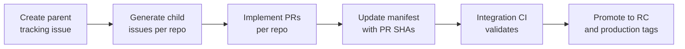
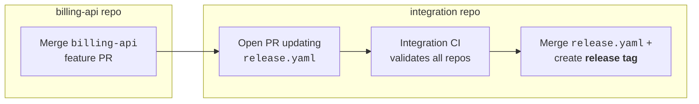
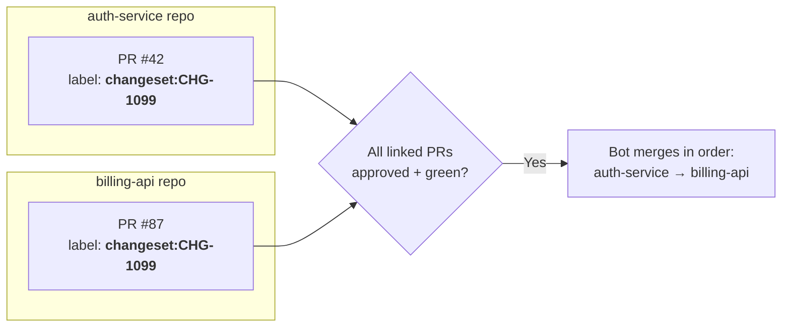

<!-- markdownlint-disable MD025 -->
<!-- markdownlint-disable MD013 -->

<!--
See our CONTRIBUTING doc for submission details and additional writing style guidelines: https://github.com/github/github-well-architected-internal/blob/main/.github/CONTRIBUTING.md
-->

## Scenario overview

Enterprises building software as a polyrepo system—one component per
repository—gain autonomy, clearer ownership, and scalable team boundaries.
They also inherit complexity: cross-repo change coordination, dependency
compatibility, consistent CI/CD policy, security remediation at scale, and
release governance.

GitHub primitives (issues, pull requests, workflows) are repo-scoped by
design. There is no native "multi-repo change object," so organizations
must model one. Reusable workflows improve standardization but introduce
questions of adoption, drift, failures, and versioning. Security
remediation and platform migrations are continuous and inherently
cross-repo. Leaders need enterprise dashboards while teams need a
low-friction workflow that preserves autonomy.

This article presents a GitHub-first operating model for polyrepo
engineering, centered on an **integration layer (meta-repo)** pattern,
**reusable workflows** as a versioned platform interface, and **orchestration for multi-repo execution**. The design emphasizes
repeatability, auditability, and enterprise-scale observability while
minimizing friction for individual service teams.

## Key design strategies and checklist

1. **Integration layer (meta-repo) for composition validation**
   - Maintain a dedicated repository that answers "do these versions of
     components work together?" by pinning each component to an immutable
     reference (tag or SHA) in a manifest file.
   - Without an integration layer, cross-repo contract changes and release
     candidate validation rely on ad-hoc coordination, which breaks down
     at scale.
   - Anti-pattern: treating the integration repo as a monorepo that
     contains code. It should hold only manifests, integration tests, and
     CI configuration.

2. **Change sets for cross-repo coordination**
   - Model a "change set" as a parent tracking issue in the integration
     repo, with child issues created in each affected component repo. PRs
     and branches include a change set identifier (for example, `CHG-1042`)
     for traceability.
   - This creates a single coordination spine without requiring monorepo
     consolidation.
   - Anti-pattern: relying solely on Slack threads or spreadsheets for
     cross-repo coordination, which lack auditability and automation hooks.

3. **Branching and merge coordination model**
   - Choose a merge coordination approach—integration branches, meta-repo
     manifest, versioned artifacts, or linked PRs with merge gating—based
     on the risk and scope of each type of cross-repo change.
   - Establish consistent branch naming conventions and protect long-lived
     branches with repository rulesets.
   - Anti-pattern: allowing each team to invent its own branching
     convention, which fragments automation and makes cross-repo
     coordination brittle.

4. **Reusable workflows as a versioned platform interface**
   - Treat shared CI/CD workflows like a product: stable
     inputs/secrets/outputs contract, semantic versioning with major tags
     (`v1`, `v2`), changelogs, and migration guides.
   - Protect the workflow repo with CODEOWNERS, required reviews, and
     strict permissions.
   - Anti-pattern: publishing workflows without versioning or breaking
     changes without a migration path.

5. **Component releases vs. system releases**
   - Decouple individual component release cadences from system-level
     releases. Components release independently (for example, `v1.8.2`),
     while system releases happen in the integration repo (for example,
     `system-2026.01.30`).
   - This avoids coupling all repos to a single cadence.

6. **Orchestration with a safety model**
   - Use an orchestrator (GitHub App or service) for cross-repo discovery
     and coordination, with repo-scoped automated execution for implementing
     changes and opening PRs.
   - Enforce repository rulesets and CODEOWNERS against
     automation. Label artifacts for governance and
     reporting.

### Quick checklist

| Area | Action |
|------|--------|
| Integration repo | Create a manifest-driven integration repository with pinned component references |
| Change management | Define a change set template with parent/child issue conventions and identifier format |
| Branching model | Choose a merge coordination approach per change type; enforce consistent branch naming and rulesets |
| Reusable workflows | Version shared workflows with semantic versioning and protect with CODEOWNERS |
| Release governance | Separate component releases from system releases using a promotion model |
| Workflow telemetry | Emit structured telemetry from reusable workflows for enterprise dashboards |
| Security campaigns | Use GHAS detection with GitHub Projects for campaign coordination and SLA tracking |
| Orchestration | Deploy an orchestrator/executor pattern with least-privilege GitHub App permissions |
| Pinning policy | Pin workflows and dependencies to stable tags or SHAs; avoid floating refs in production |


This article focuses on design thinking and coordination patterns for
polyrepo engineering. GitHub Docs remains the source of truth for
configuring individual features such as reusable workflows, rulesets,
and GitHub Advanced Security.


## Assumptions and preconditions

- The organization uses GitHub Enterprise Cloud (GHEC) or GHEC with
  Enterprise Managed Users (EMU).
- Multiple component repositories already exist (or are planned), each
  with clear ownership and bounded CI/CD.
- Teams have adopted or are willing to adopt GitHub Actions for CI/CD
  workflows.
- GitHub Advanced Security (GHAS) is enabled for code scanning, Dependabot,
  and secret scanning.
- The organization has an analytics or observability backend (for example,
  Splunk, Datadog, Elastic, or Microsoft Sentinel) for workflow governance
  dashboards.
- Teams have sufficient GitHub Actions minutes and runner capacity for
  integration validation workflows.
- Organization administrators have approved the creation of integration
  and workflow repositories.

## Recommended implementation

### 1. Establish the integration layer (meta-repo)

Create a dedicated integration repository that serves as the composition
boundary for multi-repo validation and system releases. This repo should
contain:

- A **manifest file** (for example, `release.yaml`, `components.lock`, or
  `versions.json`) mapping components to immutable references.
- **Integration and contract test suites** that validate component
  compatibility.
- **CI workflows** that resolve the manifest, check out each component at
  its pinned ref, build the composed system, and publish an integration
  artifact.

Use release tags as the preferred reference type for production manifests.
Commit SHAs provide strong reproducibility. PR SHAs can be used for
pre-merge integration candidates but should be promoted to tags before
production.

Example manifest structure:

```yaml
# release.yaml — integration manifest
components:
  auth-service:
    repo: org/auth-service
    ref: v2.4.1
  billing-api:
    repo: org/billing-api
    ref: v1.12.0
  web-frontend:
    repo: org/web-frontend
    ref: v3.1.0-rc.2
```

A standard integration validation workflow:

1. Resolve the manifest and check out each component at its pinned ref
1. Build or assemble the composed system
1. Run integration and contract test suites
1. Publish an integration artifact (bundle, compose file, Helm chart, SBOM)
1. Produce a clear status signal used for promotion decisions

### 2. Implement the change set pattern

Because GitHub lacks a cross-repo change primitive, model one explicitly:

- Assign a **change set identifier** (for example, `CHG-1042`) to each
  cross-repo change.
- Create a **parent tracking issue** in the integration repo with scope,
  impacted repos, and acceptance criteria.
- Generate **child issues** in each affected component repo, linked to the
  parent.
- Include the change set ID in PR titles and branch names for traceability.
- Update the integration manifest to reference PR SHAs during validation,
  then promote to tags on success.

Lifecycle of a multi-repo change:



Use GitHub Projects to track all issues and PRs in a change set. Configure
custom fields for change set ID, team, priority, SLA date, and status.
Automate status transitions from PR events and check results.

### 3. Choose a branching and merge coordination model

Polyrepo systems need an explicit strategy for merging coordinated
changes across repositories. Unlike a monorepo where a single PR can
touch all affected code, polyrepo changes produce separate PRs that must
converge. Choose the model that matches your coordination frequency,
risk tolerance, and team maturity.

#### Option 1: Integration branch (release-train model — most reliable)

Each repo maintains `main` plus an `integration/<train-id>` (or
`release/x.y`) branch. Coordinated PRs target the integration branch. A
central workflow checks out all repos at their integration refs and runs
end-to-end tests. If green, you promote by merging integration → `main`
in each repo, typically in an enforced order.

Example: A breaking API change spans `auth-service`, `billing-api`, and
`web-frontend`. Each repo creates a branch
`integration/CHG-1042-auth-v3`. Developers open PRs against that branch.
A workflow in the integration repo checks out all three repos at their
`integration/CHG-1042-auth-v3` HEAD, builds the composed system, and
runs contract tests. Once green, a promotion script merges
integration → `main` in `auth-service` first (the provider), then the
two consumers, and tags each with `v3.0.0`.

```text
auth-service        main ─────────────────●── (merge + tag v3.0.0)
                          ╲                ╱
                           integration/CHG-1042-auth-v3
                                           ↑ CI validates all repos here

billing-api         main ─────────────────●── (merge + tag v2.1.0)
                          ╲                ╱
                           integration/CHG-1042-auth-v3

web-frontend        main ─────────────────●── (merge + tag v4.0.0)
                          ╲                ╱
                           integration/CHG-1042-auth-v3
```

#### Option 2: Meta-repo manifest (common in enterprises)

A dedicated repo holds a manifest (lockfile) pinning each component to
an immutable ref. PRs in component repos trigger automated manifest
updates. CI validates the meta repo by checking out each repo at pinned
SHAs. Once the meta-repo PR merges, you tag the component repos
accordingly. See [Section 1](#1-establish-the-integration-layer-meta-repo)
for manifest structure.

Example: A developer merges a feature in `billing-api` repo. Automation
updates the meta-repo manifest `release.yaml`, CI validates, and on success the
`integration` repo cuts a system release:



#### Option 3: Versioned artifacts (decouple merges entirely)

Components merge and release independently, publishing immutable
artifacts (packages, containers) with a version tag. Downstream repos
consume artifacts at explicit versions. Coordination becomes
version-bump PRs rather than simultaneous merges.

Example: `auth-service` publishes a container image
`ghcr.io/org/auth-service:v2.5.0`. The `web-frontend` repo has
Dependabot or a custom workflow that detects the new version and opens a
PR bumping the reference. The `web-frontend` team reviews and merges on their own cadence. No
cross-repo branch coordination is needed.

#### Option 4: Linked PRs with merge gating (lighter-weight)

Keep PRs in each repo, link them, and only merge when all are ready.
Each PR references the others via labels (for example,
`changeset:CHG-1042`) or description links. A required status check
verifies all linked PRs are approved and passing before any can merge.
A bot merges them in a defined order.

Example: A shared logging format change touches `auth-service` and
`billing-api`. Each repo gets a PR against `main` with the label
`changeset:CHG-1099`. A required status check (for example, a GitHub
Actions workflow triggered by `pull_request` events) queries the GitHub
API to verify that every PR with the same `changeset:CHG-1099` label is
approved and has passing checks. Only when all linked PRs are ready does
the bot merge them in the declared order: `auth-service` first, then
`billing-api`.



#### Selecting a coordination model

Most organizations use more than one of these options depending on the
type of change:

- **Breaking API or contract changes** that span multiple repos typically
  warrant the **integration branch** or **meta-repo manifest** approach
  for strongest pre-merge validation.
- **Routine dependency updates** are best handled through **versioned
  artifacts**, where each component releases independently and consumers
  update at their own pace.
- **Small, low-risk cross-repo changes** (for example, a shared
  configuration tweak affecting two repos) can use **linked PRs with
  merge gating** to avoid process overhead.

#### Branching conventions

Regardless of coordination model, establish consistent branch naming
across repos:

- Use a shared prefix for coordinated work, for example
  `changeset/CHG-1042/short-description` or
  `integration/2026-q1-release`.
- Protect long-lived branches (`main`, `release/*`, `integration/*`)
  with [repository rulesets](https://docs.github.com/en/repositories/configuring-branches-and-merges-in-your-repository/managing-rulesets/about-rulesets)
  to enforce required reviews, status checks, and linear history where
  appropriate.
- Delete feature and changeset branches after merge to keep repos clean.
  Configure
  [automatic branch deletion](https://docs.github.com/en/repositories/configuring-branches-and-merges-in-your-repository/configuring-pull-request-merges/managing-the-automatic-deletion-of-branches)
  in repository settings.


Linked-PR merge gating without automation is fragile. Race conditions
can leave repos in an inconsistent state if merges happen out of order.
Always pair this approach with a merge-ordering bot or automation script.


### 4. Set up reusable workflow governance

Create a centralized workflow repository and treat it as an internal
platform product:

- Define stable contracts with documented inputs, secrets, and outputs.
- Use **semantic versioning** with major tags (`v1`, `v2`) and full
  version tags (`v1.2.3`).
- Protect the repository with CODEOWNERS, required reviews, and branch
  rulesets.
- Publish changelogs and migration guides for breaking changes.

#### Workflow governance dashboard

GitHub does not provide a single enterprise-wide reusable workflow usage
report. Build a dashboard using your analytics backend with two
complementary data feeds:

**Inventory (references)**: Shared workflows with the called ref.

**Runtime metrics (executions)**: Capture at minimum:

- Caller repo and workflow
- Reusable workflow path and version/ref
- Run ID, attempt number, event type, and actor
- Conclusion and duration

Recommended dashboard views:

| View | Purpose |
|------|---------|
| Adoption matrix | Repo/team vs. workflow; pinned version; last run |
| Version distribution | Workflow usage by version (v1/v2/SHA) |
| Reliability | Failure rate and regressions by workflow/version |
| Performance | p50/p95 duration trends by workflow/version |
| Run volume | Runs per day; runaway detection for cost signals |

### 5. Define the release governance model

Separate component releases from system releases to avoid coupling all
repos to one cadence:

- **Component releases** happen per repo using version tags (for example,
  `v1.8.2`).
- **System releases** happen in the integration repo (for example,
  `system-2026.01.30`). The system release manifest provides a
  reproducible bill of materials.

Promotion pipeline:

| Stage | Manifest references | Gate |
|-------|-------------------|------|
| Development | Component PRs merged per repo | PR checks pass |
| Integration candidate | Manifest points to PR SHAs or pre-release tags | Integration CI validates |
| Release candidate | Manifest points to RC tags | Stakeholder sign-off |
| Production | Manifest points to stable tags; system release cut | Final validation |


Avoid floating refs (`@main`) in production paths. Pin workflows and
dependencies to stable references: reusable workflows at `@vN` or
`@vN.N.N`, and integration manifests at release tags or SHAs. Use PR
SHAs only in integration candidates, then promote to tags.


### 6. Implement security campaigns with GHAS

Use GitHub Advanced Security capabilities as the system of record for
detection:

- **Code scanning** for vulnerability detection in source code
- **Dependabot alerts** for dependency vulnerabilities
- **Secret scanning** for exposed credentials

Create a Security Campaign with included repos, clear SLA processes,
assigned ownership, and progress and exception reporting.

If policy requires an issue per alert, implement alert-to-issue automation
with:

- Severity thresholds to control issue volume
- Deduplication by alert identifier
- Lifecycle syncing (close issue when alert is fixed or dismissed)
- Special handling for sensitive alerts

### 7. Deploy orchestration model

Use the **orchestrator/executor pattern** for multi-repo operations:

- **Orchestrator** (GitHub App or service): Handles cross-repo discovery,
  creates standardized issues across repos, and coordinates work via
  GitHub Projects.
- **Executor** (repo-scoped automated execution): Implements changes and opens PRs
  within a single repository where it has local context.


This recommendation focuses on automation in general. Automated execution
can range from deterministic scripts to generative agents.


Multi-repo issue creation by the orchestrator should include:

- Consistent remediation steps and acceptance criteria
- Campaign labels and backlinks to the parent tracking issue
- Deduplication markers in issue bodies to prevent duplicates
- Automatic population into a Project for unified tracking

Safety model for automated execution:

- Use GitHub Apps with least-privilege permissions instead of personal
  access tokens.
- Enforce repository rulesets and CODEOWNERS against automation.
- Rate-limit and stage rollouts across repos.
- Label all automated artifacts for governance and reporting.

### 8. Compose a unified experience

A single pane of glass for polyrepo engineering is created by combining
multiple views:

- **GitHub Projects** as the work hub for cross-repo tracking, containing
  parent tracking issues, child issues, and linked PRs with custom fields
  for change set, team, priority, and SLA date.
- **Workflow governance dashboards** for enterprise CI visibility (adoption,
  reliability, performance, and version migration progress).
- **GHAS overview** plus execution boards for security posture and
  remediation tracking.
- Correlation identifiers (change set IDs, workflow version refs) that tie
  views together.

Some enterprises add an **internal developer portal** that aggregates the
current system release manifest, active change sets, workflow health
metrics, and security posture summaries. This portal is backed by GitHub
APIs, analytics queries, and service catalog metadata.

## Additional solution detail and trade-offs to consider

### Why a meta-repo instead of a monorepo

The integration layer pattern preserves team autonomy by keeping component
code in separate repositories while adding a thin coordination layer.
Unlike a monorepo, it does not require teams to share a single build
system, CI pipeline, or branching strategy. However, it introduces
additional operational overhead: the manifest must be kept current, and
integration CI must be reliable enough to serve as a gate.

**When this is not a good fit**: Organizations with fewer than ten
repositories or tightly coupled components may find a monorepo simpler.
The meta-repo pattern adds value primarily when teams operate at different
cadences, when component ownership boundaries are clear, and when the
organization needs to validate cross-repo compatibility at scale.

### Change set overhead

The change set pattern adds a layer of process (parent/child issues,
naming conventions, manifest updates) that may feel heavyweight for small
teams. The benefit scales with the number of repos and teams involved in
cross-cutting changes. Start with lightweight conventions (a consistent
issue title prefix) and formalize only as coordination pain increases.

### Tradeoffs of branching and coordination options

| Option | Benefit | Risk | Best for |
|----------|---------|------|----------|
| Integration branch | Best correctness guarantees; supports many repos; clear audit trail | Highest process overhead; requires automation to promote integration to `main` | High-risk cross-repo changes requiring pre-merge validation of the combined state |
| Meta-repo manifest | Makes combined state explicit and reproducible; great for deployments and audit | Extra repo and manifest PR per change unless automated | Enterprises needing a reproducible bill of materials and single combined deployment state |
| Versioned artifacts | Most scalable; fully decoupled release cadences | Requires mature artifact and versioning discipline; slower feedback on integration issues | Teams with clear producer/consumer relationships and mature CI/CD pipelines |
| Linked PRs with merge gating | Minimal branching complexity; works with existing `main` flow | Not atomic; race conditions without a merge-ordering bot | Small-scope cross-repo changes where process overhead must be minimal |

Many organizations start with **linked PRs** for simplicity and graduate
to the **integration branch** or **meta-repo manifest** model as the
number of coordinated cross-repo changes grows. **Versioned artifacts**
work well in parallel for components with clear producer/consumer
boundaries.

### Reusable workflow versioning trade-offs

| Approach | Benefit | Risk |
|----------|---------|------|
| Pin to major tag (`@v1`) | Teams get bug fixes automatically | Breaking changes in minor updates if not careful |
| Pin to exact version (`@v1.2.3`) | Full reproducibility | Requires manual updates for every fix |
| Pin to SHA | Strongest immutability | Difficult to audit and manage at scale |

In most organizations, pinning to major tags with a documented
compatibility contract strikes the best balance. Use exact versions or
SHAs for regulated or high-assurance pipelines.

### Automated execution guardrails

Automated execution, especially agentic execution operating across repos,
can amplify both productivity and risk.
Without guardrails, they can create excessive issues, open low-quality
PRs, or consume significant Actions compute. Key mitigations:

- Scope each execution to a single repo with limited permissions.
- Use repository rulesets and required reviews to gate all automated
  changes.
- Implement rate limits at the orchestrator level to prevent runaway
  execution.
- Monitor automated execution activity through labels and dashboards to detect anomalies
  early.

### Phased adoption roadmap

Adopt these patterns incrementally rather than all at once:

| Phase | Focus | Key deliverables |
|-------|-------|-----------------|
| Phase 1 | Standardize and observe | Central workflow repo with versioning; runtime telemetry; baseline dashboards |
| Phase 2 | Integration layer, change sets, and branching | Integration repo with manifest; change set templates; branching conventions and rulesets; CI validation and system release tagging |
| Phase 3 | Orchestration rollout | Orchestrator app for cross-repo issues; agent-ready primitives; pilot campaigns |
| Phase 4 | Security campaign automation | Alert-to-issue automation with deduplication; campaign reporting and SLA management |

## Seeking further assistance

{}

## Related links

{}

### External resources

- [Exploring repository architecture strategy]()
