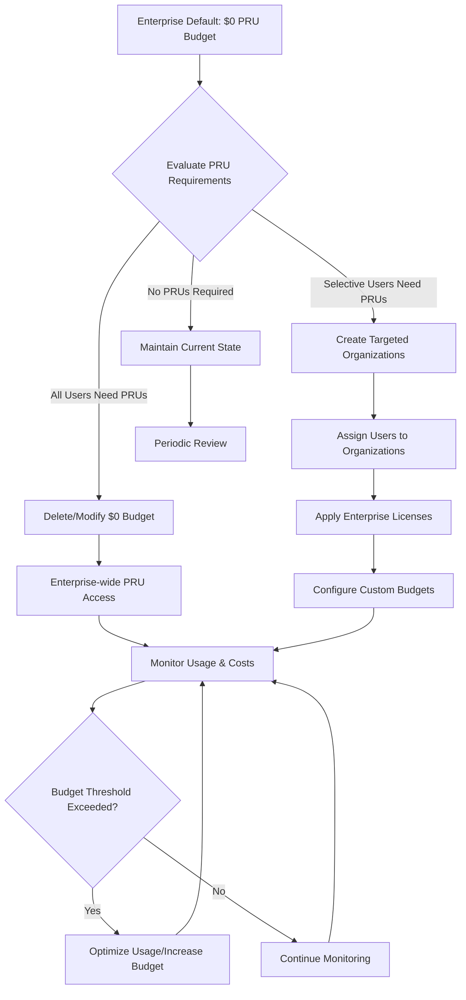

<!-- This disables the linting rule for multiple top-level headers -->
<!-- markdownlint-disable MD025 -->

<!--
See our CONTRIBUTING doc for submission details and additional writing style guidelines: https://github.com/github/github-well-architected-internal/blob/main/.github/CONTRIBUTING.md
-->

## Scenario overview

This playbook provides enterprise administrators with comprehensive guidance on managing GitHub Copilot Premium Request Units (PRUs). It includes operational procedures, cost management strategies, and administrative workflows essential for effective enterprise-scale deployment.

Upon completion of this playbook, administrators will be able to:

- Understand PRU fundamentals and billing mechanisms
- Configure enterprise-wide PRU budgets and policies
- Monitor and optimize PRU consumption across the organization
- Execute user license upgrades and organizational restructuring
- Implement cost controls and usage governance

## Key design strategies and checklist

### Pre-Implementation Assessment

- [ ] Current user count and license distribution analyzed
- [ ] Projected PRU consumption calculated
- [ ] Budget approval obtained
- [ ] Organizational structure planned
- [ ] Administrative roles assigned

### Configuration Phase

- [ ] Enterprise PRU budget configured
- [ ] Organizational budgets established
- [ ] User licenses assigned appropriately
- [ ] Access controls implemented
- [ ] Monitoring and alerting configured

### Post-Implementation Validation

- [ ] User access to premium features verified
- [ ] Budget tracking systems operational
- [ ] Usage reporting mechanisms active
- [ ] Training materials distributed
- [ ] Support procedures communicated

### Ongoing Operations

- [ ] Monthly usage reports generated
- [ ] Budget performance reviewed
- [ ] Optimization opportunities identified
- [ ] Policy updates communicated
- [ ] User feedback collected and addressed

## Assumptions and preconditions

- **Budget Examples:** Dollar amounts ($100-$500) are realistic industry examples, not prescribed values
- **KPI Targets:** Percentages and thresholds are based on enterprise best practices, requiring organizational calibration
- **Timeframes:** Response times and implementation phases are suggested frameworks, not mandatory requirements
- **Team Structures:** Organizational models are generic examples requiring customization for specific enterprises
- **User Classifications:** Role-based categories are illustrative and should be adapted to actual organizational structures

## Recommended deployment

### Table of Contents

1. [Fundamentals](#1-fundamentals)
2. [Planning & Configuration](#2-planning--configuration)
3. [Implementation Procedures](#3-implementation-procedures)
4. [Monitoring & Optimization](#4-monitoring--optimization)
5. [Administrative Reference](#5-administrative-reference)
6. [Troubleshooting](#6-troubleshooting)
7. [Appendices](#7-appendices)

### 1. Fundamentals

#### 1.1 Premium Request Units Overview

**What are PRUs?**
Premium Request Units (PRUs) represent usage credits for advanced GitHub Copilot features that exceed standard plan allowances. These units enable access to:

- Advanced AI models (Claude, Gemini, etc.)
- Agentic coding capabilities (Copilot cloud agent)
- Enhanced code review capabilities (Copilot Code Review)

For governance-specific controls around cloud agents — policy configuration, security boundaries, MCP governance, and audit pipelines — see [Governing AI cloud agents in GitHub Enterprise]().

**Key Principles:**

- PRUs reset monthly on the 1st at 00:00:00 UTC
- Unused PRUs do not roll over to the next month
- Default enterprise setting blocks all PRU overages ($0 budget)
- Administrative intervention required to enable premium features

#### 1.2 Business Impact Assessment

**Cost Implications:**

- Base overage rate: $0.04 USD per premium request
- Potential for significant cost escalation without proper controls
- Direct impact on IT budget and resource allocation

**Operational Benefits:**

- Enhanced developer productivity with advanced AI models
- Improved code quality through advanced review features
- Accelerated development cycles with cloud agents

### 2. Planning & Configuration

Before enabling additional Premium Requests its important to understand which Copilot plan your users have been assigned and what each tier provides. Refer to the [GitHub Copilot plans documentation](https://docs.github.com/en/enterprise-cloud@latest/copilot/get-started/plans#comparing-copilot-plans) for more details.

Also keep in mind that different models have different request multipliers, which changes the effective cost per request. Refer to the [GitHub Copilot model multipliers documentation](https://docs.github.com/en/enterprise-cloud@latest/copilot/concepts/billing/copilot-requests) for more details.

A deliberate assignment strategy ensures:

1. Power users (e.g., senior engineers, platform, AI productivity champions) aren’t throttled in their use of premium capabilities.
2. Broad populations (e.g., general developers or light consumers) aren’t over-provisioned.
3. Premium model usage (and therefore PRU spend exposure) stays concentrated where it produces more ROI.

### 3. Implementation Procedures

#### 3.1 Budget Configuration Workflows

##### Scenario A: Enterprise-Wide PRU Enablement

**Objective:** Enable PRU overages for all users across the enterprise

**Prerequisites:**

- Enterprise Owner or Billing Manager privileges
- Understanding of projected monthly PRU consumption
- Approved budget allocation

**Procedure:**

1. **Access Enterprise Settings**
   - Navigate to GitHub Enterprise settings
   - Select "Billing and licensing" → "Budgets and alerts"

2. **Modify Default Budget**
   - Locate current $0 budget setting
   - Choose one of the following actions:
     - **Option A:** Delete $0 budget (enables unlimited PRU usage)
     - **Option B:** Increase budget to specific dollar amount

3. **Validation**
   - Verify budget change is reflected immediately
   - Confirm all users can now access premium features
   - Monitor initial usage patterns

##### Scenario B: Selective User Enablement

**Objective:** Enable PRUs for specific teams or user groups

**Prerequisites:**

- Organizational structure planning
- User classification and requirements analysis

**Procedure:**

1. **Create Organizational Boundaries**

   ```text
   Enterprise → Organization A (Development Team)
            → Organization B (QA Team)
            → Organization C (Standard Users)
   ```

2. **License Assignment**
   - Assign Copilot Enterprise licenses to Organizations A & B
   - Maintain Copilot Business licenses for Organization C
   - Configure custom budgets per organization

3. **User Migration**
   - Move target users to appropriate organizations
   - Validate license assignments
   - Communicate changes to affected users

##### Scenario C: Cost Center Management

**Objective:** Implement granular budget controls with departmental allocation

**Prerequisites:**

- Organizational structure planning
- User classification and requirements analysis
- Cost center allocation


The following budget amounts and consumption estimates are provided as realistic examples for planning purposes. Organizations should adjust these values based on their specific requirements, team sizes, and usage patterns.


**Example Implementation Framework:**

| Organization/Cost Center    | Monthly Budget  | License Type | User Count | Estimated PRUs/Month |
| --------------------------- | --------------- | ------------ | ---------- | -------------------- |
| **Senior Development Team** | $500            | Enterprise   | 15-20      | 300-500              |
| **QA/Testing Team**         | $200            | Enterprise   | 8-12       | 100-200              |
| **DevOps Team**             | $300            | Enterprise   | 5-8        | 200-300              |
| **Junior Developers**       | $100            | Business     | 20-30      | 50-100               |
| **General Users**           | $0 (restricted) | Business     | 100+       | 0                    |

**Consumption Patterns by Role:**

- **Senior Developers:** Heavy usage of premium models (Claude Opus, o3) for complex problems
- **Junior Developers:** Moderate usage focusing on learning and code assistance
- **DevOps Engineers:** High usage for automation and infrastructure coding
- **QA Teams:** Targeted usage for test automation and code review


These budget amounts reflect typical enterprise deployments but should be validated through pilot programs and adjusted based on actual consumption patterns.


#### 3.2 User License Management

##### Upgrade Procedures

##### Standard Business → Enterprise Upgrade

**Step-by-Step Process:**

1. **Assessment Phase**
   - Identify users requiring premium features
   - Calculate cost impact of upgrade
   - Obtain budget approval

2. **Organizational Restructuring**

   ```text
   Current: Enterprise → Single Org → All Users (Business License)

   Target:  Enterprise → Senior Dev Team (Enterprise + $500 budget)
                      → QA Team (Enterprise + $200 budget)
                      → Junior Devs (Business + $100 budget)
                      → General Users (Business + $0 budget)
   ```

3. **Implementation Timeline**
   - **Phase 1 (0-30 days):** Create organizations and assign core development team
   - **Phase 2 (30-60 days):** Migrate QA and DevOps teams with budget allocation
   - **Phase 3 (60-90 days):** Evaluate junior developer access and general user needs
   - **Phase 4 (90+ days):** Optimize based on usage data and feedback

4. **Verification**
   - Test premium feature access
   - Validate billing configuration
   - Confirm user satisfaction

### 4. Monitoring & Optimization

#### 4.1 Usage Analytics & Reporting

##### Monthly Reporting Checklist

**Data Collection Points:**

- [ ] Total PRU consumption by organization
- [ ] Top 10 users by PRU usage
- [ ] Feature-specific consumption patterns
- [ ] Model usage distribution
- [ ] Cost analysis and budget variance

**Reporting Schedule:**

- **Weekly:** High-level usage trends
- **Monthly:** Comprehensive cost analysis
- **Quarterly:** Strategic optimization review

##### Key Performance Indicators (KPIs)


The following KPI targets are based on industry benchmarks and enterprise deployment patterns. Organizations should establish their own targets based on baseline measurements and business objectives.


**Baseline Performance Targets:**

| Metric Category         | Target Range               | Monitoring Focus        | Optimization Trigger   |
| ----------------------- | -------------------------- | ----------------------- | ---------------------- |
| **Monthly PRU Growth**  | 10-20% month-over-month    | Track adoption patterns | >25% unexpected growth |
| **Cost per Developer**  | $10-30/month average       | Budget efficiency       | >$50/month per user    |
| **Budget Utilization**  | 70-85% of allocated budget | Spending control        | >90% utilization       |
| **Feature Adoption**    | 60%+ active daily users    | Usage effectiveness     | <40% engagement        |
| **Premium Model Usage** | 20-30% of total requests   | Cost optimization       | >50% premium usage     |

**Monthly Reporting Benchmarks:**

- **Low Usage Organizations:** <100 PRUs/month per user
- **Medium Usage Organizations:** 100-300 PRUs/month per user
- **High Usage Organizations:** >300 PRUs/month per user

**Cost Efficiency Targets:**

- **Optimal Range:** 15-25% of total Copilot spend on PRUs
- **Alert Threshold:** >40% of budget on premium features
- **Review Trigger:** >60% budget utilization by mid-month


These targets should be calibrated based on your organization's development practices, team experience levels, and project complexity.


#### 4.2 Cost Optimization Strategies

##### Immediate Actions

- **Model Usage Optimization:** Encourage use of included models (GPT-4.1, GPT-4o) for routine tasks
- **Feature Education:** Train users on cost-effective feature usage patterns
- **Budget Alerts:** Implement automated notifications based on organizational thresholds

##### Medium-term Initiatives

- **User Segmentation:** Classify users by actual vs. projected PRU consumption
- **License Optimization:** Right-size licenses based on usage patterns
- **Policy Development:** Establish governance guidelines for premium feature usage

##### Long-term Strategic Initiatives

- **Advanced Analytics:** Implement monitoring systems for PRU consumption patterns
- **Integration Assessment:** Evaluate third-party tool integrations for cost efficiency
- **Organizational Review:** Assess org structure effectiveness based on usage data

#### 4.3 Operational Workflows

##### Enterprise PRU Management Process Flow



##### PRU Billing Hierarchy Structure

The PRU Billing Hierarchy begins with the **Enterprise Admin**, who is responsible for setting enterprise-wide policies, managing billing, and monitoring overall usage.

From the Enterprise Admin, three different types of organizations are defined:

1. **Organization A (Team/Department)**
   - Licenses are assigned based on team needs.
   - Budget allocations are provided according to requirements.
   - Feature access is configured as needed.
   - Team members use resources based on their roles and have access to assigned models.

2. **Organization B (Team/Department)**
   - Similar to Organization A with licenses tailored to specific needs.
   - Budget allocation and feature access are configured accordingly.
   - Team members operate with role-based usage and access to models.

3. **Organization C (Standard Users)**
   - Designed for standard users with business licenses.
   - Restricted or no PRU budget.
   - Access limited to standard features.
   - Standard users have basic Copilot features but no PRU access.

**In summary:**
The Enterprise Admin governs and manages policies and budgets across all organizations, while each organization determines licenses and access based on business requirements. Team members and standard users then utilize features and resources aligned with their assigned roles and budget levels.


This diagram shows a generic organizational structure. Actual implementations should be customized based on specific organizational needs, team structures, and business requirements.


### 5. Administrative Reference

#### 5.1 Role-Based Access Control (RBAC)

##### Administrative Roles and Permissions

| Role Title             | Scope                 | Core Permissions           | PRU-Specific Capabilities                                                                                                 |
| ---------------------- | --------------------- | -------------------------- | ------------------------------------------------------------------------------------------------------------------------- |
| **Enterprise Owner**   | Enterprise-wide       | Full administrative access | • Set enterprise PRU budgets<br/>• Create/delete organizations<br/>• View all usage reports<br/>• Manage billing settings |
| **Organization Owner** | Organization-specific | Org-level administration   | • Assign Copilot seats<br/>• Manage org PRU budgets<br/>• View org usage reports<br/>• Configure member access            |
| **Billing Manager**    | Enterprise or Org     | Financial management       | • Monitor PRU costs<br/>• Configure budget alerts<br/>• Access billing reports<br/>• Manage payment methods               |
| **Repository Admin**   | Repository-specific   | Code management            | • View repository usage<br/>• Configure repository policies<br/>• Access basic usage metrics                              |

#### 5.2 Administrative Task Matrix

##### Routine Operations (Daily/Weekly)

| Task Category        | Frequency | Responsible Role   | Action Items                                                                                       |
| -------------------- | --------- | ------------------ | -------------------------------------------------------------------------------------------------- |
| **Usage Monitoring** | Daily     | Billing Manager    | • Review PRU consumption alerts<br/>• Check budget utilization<br/>• Validate unusual usage spikes |
| **User Support**     | As needed | Organization Owner | • Handle access requests<br/>• Resolve license assignment issues<br/>• Provide feature guidance    |
| **Cost Analysis**    | Weekly    | Billing Manager    | • Generate usage reports<br/>• Calculate cost per user<br/>• Identify optimization opportunities   |

##### Strategic Operations (Monthly/Quarterly)

| Task Category            | Frequency | Responsible Role | Action Items                                                                                            |
| ------------------------ | --------- | ---------------- | ------------------------------------------------------------------------------------------------------- |
| **Budget Planning**      | Monthly   | Enterprise Owner | • Review budget performance<br/>• Adjust allocations as needed<br/>• Plan for next month's requirements |
| **License Optimization** | Quarterly | Enterprise Owner | • Analyze license utilization<br/>• Right-size user assignments<br/>• Evaluate plan upgrades/downgrades |
| **Policy Review**        | Quarterly | Enterprise Owner | • Update usage policies<br/>• Revise governance guidelines<br/>• Communicate policy changes             |

#### 5.3 Configuration Management

##### Budget Configuration Options

| Configuration Type          | Implementation Method                    | Use Case                            | Impact Level      |
| --------------------------- | ---------------------------------------- | ----------------------------------- | ----------------- |
| **Global Unlimited**        | Delete $0 enterprise budget              | All users need premium access       | High cost risk    |
| **Global Limited**          | Set enterprise budget to specific amount | Controlled enterprise-wide spending | Medium cost risk  |
| **Organizational Budgets**  | Create org-specific budgets              | Departmental cost control           | Low cost risk     |
| **User-Level Restrictions** | Individual license management            | Precise cost control                | Minimal cost risk |

##### Emergency Procedures


Response timeframes are suggested based on enterprise best practices. Organizations should adjust these based on their operational requirements and support capabilities.


**Budget Overage Response Protocol:**

1. **Immediate Response (0-2 hours)**
   - Identify cause of overage (automated alerts recommended)
   - Assess business impact and user disruption
   - Implement temporary restrictions if necessary

2. **Short-term Actions (2-24 hours)**
   - Communicate with affected users and stakeholders
   - Adjust budgets or implement policy changes
   - Document incident details for analysis

3. **Follow-up Analysis (24-72 hours)**
   - Conduct root cause analysis with usage data
   - Update policies and procedures based on findings
   - Implement preventive measures and monitoring improvements

**Escalation Response Times:**

- **Critical Issues:** 1 hour response (service outages, security)
- **High Priority:** 4 hours response (budget exceeded >200%)
- **Medium Priority:** 24 hours response (policy violations, anomalies)
- **Low Priority:** 72 hours response (general questions, training)

### 6. Troubleshooting

#### 6.1 Common Issues and Resolutions

##### Issue: Users Cannot Access Premium Features

**Symptoms:**

- Premium models not available in Copilot Chat
- cloud agents disabled or restricted
- Error messages about PRU limitations

**Diagnostic Steps:**

1. Verify user's organization assignment
2. Check organization's PRU budget status
3. Confirm license type (Business vs. Enterprise)
4. Review enterprise-level budget settings

**Resolution Path:**

```text
Problem Identified → Check Budget Status → Adjust Configuration → Validate Access → Monitor Usage
```

**Solutions:**

- **Budget Issue:** Increase or delete $0 budget restriction
- **License Issue:** Upgrade user to appropriate license tier
- **Organizational Issue:** Move user to organization with PRU access

##### Issue: Unexpected High PRU Consumption

**Symptoms:**

- Rapid budget depletion
- Usage alerts triggering frequently
- Costs exceeding projections

**Investigation Protocol:**

1. **Identify Top Consumers**
   - Generate user-level usage reports
   - Analyze feature-specific consumption
   - Review model selection patterns

2. **Pattern Analysis**
   - Compare with historical usage
   - Identify unusual activity spikes
   - Correlate with business events

3. **Optimization Actions**
   - User education on cost-effective practices
   - Policy adjustments for high-cost models
   - Budget reallocation or restrictions

#### 6.2 Escalation Procedures

##### Severity Levels

| Level        | Criteria                             | Response Time | Escalation Path                    |
| ------------ | ------------------------------------ | ------------- | ---------------------------------- |
| **Critical** | Service outage, security breach      | 1 hour        | Enterprise Owner → GitHub Support  |
| **High**     | Budget exceeded by >50%              | 4 hours       | Billing Manager → Enterprise Owner |
| **Medium**   | Usage anomalies, policy violations   | 24 hours      | Org Owner → Billing Manager        |
| **Low**      | General questions, training requests | 72 hours      | User → Org Owner                   |

#### 6.3 Preventive Measures

##### Monitoring Alerts Configuration


These threshold percentages are based on enterprise financial management best practices. Organizations should adjust based on their risk tolerance and budget management processes.


**Standard Alert Levels:**

- **Early Warning:** 75% of monthly budget consumed
- **Critical Alert:** 90% of monthly budget consumed
- **Executive Notification:** 95% of monthly budget consumed
- **Automatic Restrictions:** 100% of monthly budget consumed

**Usage Pattern Monitoring:**

- **Anomaly Detection:** >3x average daily consumption
- **New User Monitoring:** Track first 30 days of usage patterns
- **Model Usage Alerts:** >50% premium model usage in department
- **Cost Efficiency Reviews:** Monthly cost-per-user above $50

**Recommended Monitoring Frequency:**

- **Real-time:** Budget consumption and overage alerts
- **Daily:** Usage pattern analysis and anomaly detection
- **Weekly:** Cost efficiency and trend analysis
- **Monthly:** Comprehensive usage review and optimization planning


Alert thresholds should be calibrated during initial deployment and adjusted based on actual consumption patterns and business requirements.


### 7. Appendices

#### Appendix A: Quick Reference Guide

##### Critical Facts Summary

| Configuration Item        | Default Value              | Impact                    | Administrative Action Required    |
| ------------------------- | -------------------------- | ------------------------- | --------------------------------- |
| **Enterprise PRU Budget** | $0 (overages blocked)      | No premium feature access | Delete or modify budget to enable |
| **PRU Cost Rate**         | $0.04 USD per request      | Direct billing impact     | Monitor and control via budgets   |
| **Reset Schedule**        | 1st of month, 00:00:00 UTC | Monthly consumption reset | Plan budgets accordingly          |
| **Budget Change Timing**  | Immediate effect           | Real-time access control  | Can adjust mid-month as needed    |
| **Overage Capability**    | Paid plans only            | Feature availability      | Free plans cannot exceed limits   |

## Seeking further assistance

{}

## Related links

- [GitHub Copilot Billing Documentation](https://docs.github.com/en/enterprise-cloud@latest/copilot/concepts/billing)
- [Managing Premium Request Allowance](https://docs.github.com/en/enterprise-cloud@latest/copilot/how-tos/manage-and-track-spending)
- [Enterprise Administration Best Practices](https://docs.github.com/en/enterprise-cloud@latest/admin)
- [GitHub API Documentation for Enterprise Management](https://docs.github.com/en/rest/enterprise-admin)
- [Managing premium request allowance for enterprise users](https://docs.github.com/en/enterprise-cloud@latest/copilot/how-tos/manage-and-track-spending/manage-for-your-enterprise)
- [GitHub Copilot requests overview](https://docs.github.com/en/enterprise-cloud@latest/copilot/concepts/billing/copilot-requests)
- [Copilot billing for organizations and enterprises](https://docs.github.com/en/enterprise-cloud@latest/copilot/concepts/billing/organizations-and-enterprises)
