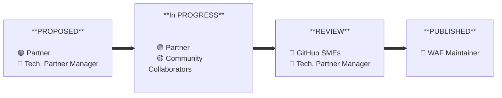

# Overview

GitHub Well‑Architected is expanding quickly—new products, new adoption patterns, and rising expectations for clear, practical, and secure guidance. To keep pace, **we’re inviting our GitHub Partners to help define the guidance that becomes the global standard.**

Partners bring something uniquely powerful: **you see what truly works** across industries, architectures, constraints, and delivery context. Your real‑world experience turns Well‑Architected from “good guidance” into **trusted, repeatable, field‑proven practice.**

This repository is your space to propose, author, and refine high‑impact content alongside GitHub SMEs and the broader community. Our goal is simple: **make contributing easy, make your impact visible, and help every customer succeed.**

## 🌟 Why we are here

Partner contributions elevate Well‑Architected in ways only you can:

- **Partners understand reality:** constraints, politics, outages, risk decisions, last‑minute pivots — the pressure points that shape real delivery outcomes.
- **This space enables collaboration:** a shared home for partners, GitHub SMEs and broader community to build design‑thinking‑led best practices.
- **Intentional matters:** in times of rapid change, sharing intent and building on one another helps everyone move faster on the knowns while exploring the unknowns with confidence.

## 🛠️ Where you can contribute

The most impactful areas for partner contributions include:

### 1️⃣ Real‑world patterns and decision guidance

- Reference patterns, tradeoffs, and common anti‑patterns observed across industries
- “What does a good GitHub platform setup look like for an organization like mine?”
- Example topics: context engineering, managing polyrepos at scale, GitHub governance patterns

### 2️⃣ Implementation‑ready playbooks

- Step‑by‑step guides, rollout sequencing, and operational readiness patterns
- “How do we roll this out safely and successfully across our teams?”
- Example topics: pilot‑to‑production playbooks, CI/CD adoption blueprints, automation and monitoring standards

### 3️⃣ Enterprise risk and compliance‑informed guidance

- Managing threat, audit, and compliance requirements using secure‑by‑default GitHub practices
- “What will security reviewers ask, and how do we prepare for it?”
- Example topics: security in agentic workflows, secure defaults, compliance‑ready configurations

### 4️⃣ Lessons learned

- Real‑world breakdowns, pivots, constraints, and pitfalls to avoid
- “What should we watch out for so we don’t repeat common mistakes?”
- Example topics: scaling challenges, workarounds for legacy constraints

### 5️⃣ Content quality improvement

- Enhancing clarity, readability, terminology, diagrams, and discoverability
- “Can you make this easier to understand, adopt, and reference?”
- Examples: consistent terminology, improved diagrams, cross‑referenced guidance

## ✅ What “good” looks like

We’re not chasing volume — we’re building **future‑ready guidance** that customers and field teams can trust.

Great content is:

- **Actionable:** clear steps, checklists, examples
- **Explicit:** tradeoffs and assumptions clearly stated
- **Responsible AI–aligned**
- **Secure by default**
- **Designed for GitHub users:** practical, grounded, and real-world usage

## 🏁 Getting started

Step 1: Use [Create a content request Issue] to propose your idea. Include:

- The problem you’re solving
- The intended audience
- Your recommended approach
- Supporting context (patterns, constraints, anonymized examples)

Step 2: Follow the contribution workflow in [CONTRIBUTING]

Step 3: Keep your Technical Partner Manager informed!

### How contributions move

A contribution moves through four simple states:

### At a glance (state → owner → responsibility)

- **PROPOSED** → **Partner**, **Technical Partner Manager**: Submit an idea; scope it, avoid duplication, and connect to the right collaborators.
- **IN PROGRESS** → **Partner**, **Community Collaborators**: Draft content; collaborators suggest improvements and examples.
- **REVIEW** → **GitHub SMEs**, **Technical Partner Manager**: Review, request changes, and approve; keep the review moving.
- **PUBLISHED** → **GitHub**: Merge and publish to the site; confirm attribution and notify the author.

## 📣 Communication & update cadence

| Type | Frequency | Channel | Content |
|-------------|-----------|----------|---------|
| Partners Newsletter | Monthly | Email | Spotlights, what shipped, what's next |
| Tech Forum | Monthly | Live online| Recognitions, priority themes, content request backlog |
| Feedback & Questions | Ad hoc | [GitHub Discussions] | Feedback, suggestions, comments, questions |

## 🎉 How we celebrate contributions

Your impact is visible and celebrated through:

- Spotlight in monthly partner newsletters
- Monthly tech forum callouts
- Recognition at partner events
- Author attribution on our site (company slug + user handle)

## 🔗 Quick resource links

- [Create a content request Issue] - 🏁 Start here!
- [CONTRIBUTING] - How we collaborate
- [GitHub Well‑Architected Framework Overview] - Our mission, pillars, principles
- [Partners Portal]
- [GitHub Discussions]

## 🚀 Call‑to‑Action

If you're ready to help shape how customers design, secure, and scale GitHub, **start by submitting a content proposal. Your experience doesn’t just help customers — it shapes the global standard for GitHub excellence.**

[CONTRIBUTING]: ../CONTRIBUTING.md
[Create a content request Issue]: https://github.com/github/github-well-architected/issues/new?assignees=&labels=content-request&template=request-content.yml
[GitHub Discussions]: https://github.com/githubpartners-community/community/discussions/categories/waf-feedback-and-suggestions
[GitHub Well‑Architected Framework Overview]: ./framework-overview.md
[Partners Portal]: https://portal.github.partners/#/page/well-architected
